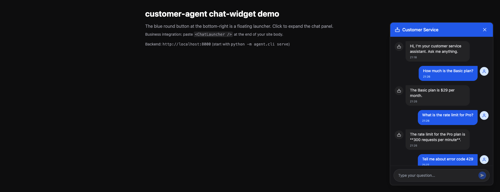

# customer-helpmesh-agent

[](LICENSE)
[](https://www.python.org/)
[](https://fastapi.tiangolo.com/)
[](https://langchain-ai.github.io/langgraph/)

[English](#english) | [中文](#中文)

---

<a name="english"></a>

## English

A **general-purpose customer service agent** — one binary that adapts to many scenarios through configuration, not code changes.

### Use cases

The same agent serves any customer service domain by swapping its `agent.yaml`:

- **Retail / e-commerce** — FAQ on returns, refunds, shipping, inventory
- **SaaS tech support** — API errors, SDK usage, rate-limit troubleshooting
- **Banking / insurance** — account queries, policy lookup, complaint triage (all through your own APIs)
- **Education / training** — curriculum Q&A, assignment help, scheduling
- **Internal IT / HR** — leave policies, ticket routing, password resets
- **Custom domains** — add knowledge files, define `@tool` business capabilities, bind a `toolset`, and define intents

The configuration is the product:

| Concern | How to swap | Where |
|---|---|---|
| LLM provider | `llm.provider` (openai / anthropic / deepseek / ollama / azure) | `agent.yaml` |
| Embedding model | `embedding.provider` + `embedding.model` | `agent.yaml` |
| Knowledge sources | `connector: local / s3 / git / notion` per source | `agent.yaml` `knowledge.sources:` |
| Document formats | `format: md / pdf / docx / xlsx / pdf_advanced / ...` per source | `agent.yaml` |
| Retrieval strategy | `retriever.strategy: vector / hybrid / multiquery / hyde` | `agent.yaml` |
| Intents (FAQ / account / complaint / ...) | `intents:` list with `builtin:*` or custom handler paths | `agent.yaml` |
| AI-selected business capabilities | Python `@tool` files + `intent.toolset` | `agent/tools/` + `agent.yaml` |
| Legacy fixed API calls | `tools:` list with endpoint + auth + templates | `agent.yaml` |
| Custom Python behavior | drop a `.py` file in `~/.customer-helpmesh-agent/handlers/` | filesystem |
| Observability | `langsmith.enabled: true` + `LANGSMITH_API_KEY` | `agent.yaml` + env |

Knowledge-only changes need no code changes: edit YAML, ingest, and restart. A new real-time business capability needs one trusted Python `@tool` wrapper, then only YAML binding and a restart.

### Features

- **Config-driven** — switch LLM / knowledge / intents / toolsets through `agent.yaml`; business capabilities are standard LangChain `@tool`s
- **Multiple knowledge sources** — local files, S3, Git repos, Notion databases
- **Multi-format documents** — md / txt / pdf / html / csv / json / jsonl / docx / xlsx
- **OCR + Vision fallback** — scanned PDFs and image-only content still get indexed
- **Hybrid retrieval** — vector + BM25, optional reranker, RRF fusion
- **Multiple LLM providers** — OpenAI / Anthropic / DeepSeek / Ollama / Azure OpenAI
- **Real user context** — HTTP headers (`Authorization` + `X-User-Id`) forwarded to tool calls
- **Token-level streaming** — SSE output, frontend displays character by character
- **LangSmith observability** — trace + evaluation + feedback
- **Custom intent handlers** — drop a Python file into `~/.customer-helpmesh-agent/handlers/`, no fork needed
- **Drop-in chat widget** — React + Tailwind component, ready to copy-paste
- **Plug-and-play BFF examples** — Next.js / Express / FastAPI templates

### 30-second quick start

```bash
docker compose up -d
curl -X POST http://localhost:8000/ingest | jq
curl -N -X POST http://localhost:8000/chat \
  -H 'Content-Type: application/json' \
  -d '{"message":"How do I recharge?"}'
```

### Install

**Docker (recommended)**

```bash
git clone https://github.com/colddew-yj/customer-helpmesh-agent
cd customer-helpmesh-agent
cp examples/agent.yaml.example agent.yaml
cp examples/.env.example .env       # fill in your OPENAI_API_KEY
mkdir -p knowledge/faq && echo "# 业务 FAQ" > knowledge/faq/index.md
docker compose up -d
curl -X POST http://localhost:8000/ingest
```

**Bare Python (local dev)**

```bash
python -m venv .venv && source .venv/bin/activate
pip install -e .
# 重排默认开；不装 FlagEmbedding 时启动 warning 跳过，仍可跑：
pip install -e ".[rerank]"
cp examples/agent.yaml.example agent.yaml
cp examples/.env.example .env
customer-helpmesh-agent                       # listens on 0.0.0.0:8000
```

`.[rerank]` 会拉 `FlagEmbedding`（~50 MB wheel）+ 首次启动自动下载 `BAAI/bge-reranker-v2-m3` 模型权重（~2 GB）到 `~/.cache/huggingface/`。

### 30-minute integration guide

Full walk-through: [docs/30min-quickstart.md](docs/30min-quickstart.md)

Six steps:
1. Prepare your knowledge documents
2. Edit `agent.yaml` (LLM / knowledge sources / intents / tools)
3. Configure `.env` (API keys)
4. `docker compose up -d` + `POST /ingest`
5. Write your BFF (see `examples/bff/nextjs/route.ts`)
6. Verify with `curl`

### Knowledge sources

`agent.yaml` supports four connectors out of the box — local files, S3-compatible storage, Git repositories, and Notion databases:

```yaml
knowledge:
  sources:
    - name: faq-local                       # local directory
      path: ./knowledge/faq
      format: md

    - name: wiki-s3                         # S3 / R2 / MinIO / Aliyun OSS
      connector: s3
      connector_config:
        bucket: company-wiki
        prefix: docs/
        endpoint_url: https://s3.amazonaws.com
        aws_key_env: AWS_ACCESS_KEY_ID
        aws_secret_env: AWS_SECRET_ACCESS_KEY

    - name: kb-git                          # Git repo
      connector: git
      connector_config:
        repo_url: https://github.com/me/kb.git
        branch: main
        path_filter: "docs/*.md"

    - name: faq-notion                      # Notion database
      connector: notion
      connector_config:
        api_key_env: NOTION_API_KEY
        database_id: xxxxxxxx-xxxx-xxxx-xxxx-xxxxxxxxxxxx
```

### Document formats

| Format | Loader | Notes |
|---|---|---|
| md / txt | TextLoader | default |
| pdf | PyMuPDFLoader | falls back to PyPDFLoader; double-column friendly |
| html / htm | BSHTMLLoader | |
| csv | CSVLoader | one row per Document |
| json / jsonl | JSONLoader | jq schema `.` |
| docx | custom (python-docx) | paragraphs + tables |
| xlsx | custom (openpyxl) | one row per Document |

OCR (tesseract) + Vision LLM fallback handles scanned PDFs and image-only content via `pdf_advanced`.

### Retrieval strategies

Choose `strategy` in `agent.yaml`:

- `vector` — pure vector retrieval
- `hybrid` — vector + BM25 with RRF fusion (default)
- `multiquery` — LangChain MultiQueryRetriever (LLM generates query variants)
- `hyde` — Hypothetical Document Embeddings

### Built-in intents

| Intent | Handler | Description |
|---|---|---|
| `faq` | `builtin:faq` | Knowledge-base Q&A (RAG) |
| `account` | `builtin:account` | Realtime data (tool call) |
| `complaint` | `builtin:complaint` | User complaints (no retrieval) |
| `chat` | `builtin:chat` | Small talk (no retrieval) |
| `refuse` | `builtin:refuse` | Out-of-scope (preset reply) |

Add or remove intents in `agent.yaml`'s `intents:` list. Drop custom handlers in `~/.customer-helpmesh-agent/handlers/<name>.py` — no need to fork the repo.

### Add a business capability (recommended Tool path)

From the integrator's perspective, a new business concept usually consists of:

```text
knowledge source + intent + optional Toolset
```

Use only a knowledge source when the agent needs to answer from documents. Add a Tool when the answer requires live, user-specific data such as balance, orders, usage, or shipment status.

#### 1. Add a read-only LangChain Tool

Create a module under the trusted directory `agent/tools/`. The module name becomes the Toolset name:

```python
# agent/tools/logistics.py
from langchain_core.tools import tool

@tool
def query_tracking(tracking_no: str) -> dict:
    """Query the current status and history of a shipment."""
    # Call your business backend here.
    # Read Authorization / user context from injected state when needed.
    return {"tracking_no": tracking_no, "status": "in_transit"}

TOOLS = [query_tracking]
READ_ONLY = True
```

The Tool implementation is the only place that knows how to call your business system. Keep credentials in environment variables; do not put tokens in the Tool file or `agent.yaml`.

#### 2. Bind the Toolset to an intent

```yaml
intents:
  - name: logistics
    handler: builtin:chat
    description: Shipment tracking, delivery status, and logistics questions
    uses_rag: true
    toolset: logistics
```

`toolset: logistics` exposes the whole domain collection to the model. The model chooses the concrete Tool; you do not need to list `query_tracking` in YAML.

#### 3. Restart and verify

Tool discovery runs at startup. After adding the module:

```bash
customer-helpmesh-agent
```

Ask a matching question and verify that the Tool is called with the user's forwarded context (`Authorization`, `X-User-Id`). Knowledge-only changes still require `POST /ingest` when documents change.

#### What you do not need to change

When adding a normal read-only business capability, do not modify:

- `agent/graph.py`
- LangGraph `ToolNode` or `tools_condition`
- the LLM provider integration
- one YAML endpoint entry per Tool

The current legacy `tools:` endpoint configuration remains supported for existing agents, but it is fixed API wiring. The recommended path above uses LangChain Tool Calling: `@tool → bind_tools → AIMessage.tool_calls → ToolNode`.

#### Safety boundary

The automatic discovery directory is fixed and trusted. Import errors, missing `TOOLS`, duplicate Tool names, invalid Tool objects, or non-read-only modules stop startup instead of being silently ignored. Refunds, cancellations, address changes, and other write operations are not automatically enabled; they need a later confirmation or approval flow.

### Architecture

```
┌────────────────────────────────────────────────────────────────────────────┐
│                              BROWSER / FRONTEND                            │
│  ┌─────────────────────────────────────────────────────────────────────┐  │
│  │  chat-widget (examples/chat-widget/)                                │  │
│  │  • ChatWidget.tsx — drop-in React component                          │  │
│  │  • useChatStream.ts — SSE consumer hook (independently usable)       │  │
│  │  • storage.ts — localStorage (session id + history)                  │  │
│  │  • styles.css (ca-cw-* prefix, CSS-overridable)                      │  │
│  └─────────────────────────────────────────────────────────────────────┘  │
└─────────────┬──────────────────────────────────────────────────────────────┘
              │  POST /api/agent/chat  (SSE: data: {"type":"token","content":"..."})
              │  Headers: Authorization (user token) + X-User-Id
              ▼
┌────────────────────────────────────────────────────────────────────────────┐
│                        BUSINESS BFF  (your code)                            │
│  examples/bff/nextjs/route.ts  (template)                                  │
│  • Reads your app's session cookie                                          │
│  • Forwards Authorization + X-User-Id + X-Thread-Id to agent                │
│  • Streams agent SSE back to browser (no buffering)                          │
└─────────────┬──────────────────────────────────────────────────────────────┘
              │  HTTP
              ▼
┌────────────────────────────────────────────────────────────────────────────┐
│                    customer-helpmesh-agent  (FastAPI :8000)                         │
│                                                                            │
│   ┌────────────────────────────────────────────────────────────────┐    │
│   │                      FastAPI  (server.py)                      │    │
│   │  POST /chat    → SSE stream                                   │    │
│   │  POST /ingest  → re-index knowledge                          │    │
│   │  POST /feedback → push user score to LangSmith run           │    │
│   │  GET  /health   → liveness probe                             │    │
│   └────────────────────────────────────────────────────────────────┘    │
│                              │                                            │
│   ┌────────────────────────────────────────────────────────────────┐    │
│   │                     LangGraph  (graph.py)                      │    │
│   │  classify_node  (LLM picks intent)                            │    │
│   │       │                                                        │    │
│   │       ▼                                                        │    │
│   │  ┌───────────────────────────────────────────────────────┐    │    │
│   │  │ Intent Handlers (skills/ — 5 builtin + custom)        │    │    │
│   │  │  faq        — RAG → answer                             │    │    │
│   │  │  account    — Tool-enabled agent → answer               │    │    │
│   │  │  complaint  — LLM direct (empathy prompt)             │    │    │
│   │  │  chat       — LLM direct (small-talk prompt)           │    │    │
│   │  │  refuse     — preset reply (no LLM)                    │    │    │
│   │  └───────────────────────────────────────────────────────┘    │    │
│   │       │  custom:  ~/.customer-helpmesh-agent/handlers/<name>.py:build    │    │
│   └────────────────────────────────────────────────────────────────┘    │
│                              │                                            │
│   ┌────────────────────────────────────────────────────────────────┐    │
│   │                   Retrieval Layer                              │    │
│   │  RetrieverConfig.strategy: vector | hybrid | multiquery | hyde  │    │
│   │                                                                │    │
│   │  ┌────────────── Knowledge Pipeline ──────────────────────┐    │    │
│   │  │ Connector (local / s3 / git / notion)                  │    │    │
│   │  │   ↓  sync()                                            │    │    │
│   │  │ Loader (md / pdf / html / csv / json / docx / xlsx /    │    │    │
│   │  │        pdf_advanced=PDF+OCR+Vision fallback)            │    │    │
│   │  │   ↓                                                     │    │    │
│   │  │ Splitter (RecursiveCharacterTextSplitter)              │    │    │
│   │  │   ↓                                                     │    │    │
│   │  │ Embedding (openai / huggingface / ollama / fake)       │    │    │
│   │  │   ↓                                                     │    │    │
│   │  │ Vector Store (chroma / in-memory) + BM25 chunks (pkl) │    │    │
│   │  │   ↓                                                     │    │    │
│   │  │ Retriever:  vector + BM25 → RRF / weighted              │    │    │
│   │  │            multiquery / hyde (LLM-generated variants)   │    │    │
│   │  │   ↓                                                     │    │    │
│   │  │ Reranker (FlagEmbedding cross-encoder, default-on)     │    │    │
│   │  └─────────────────────────────────────────────────────────┘    │    │
│   └────────────────────────────────────────────────────────────────┘    │
│                              │                                            │
│   ┌────────────────────────────────────────────────────────────────┐    │
│   │             LangChain Toolsets + ToolRegistry                 │    │
│   │  • @tool modules in agent/tools/ auto-discovered at startup    │    │
│   │  • LLM selects tools → ToolNode executes → graph loops        │    │
│   │  • Legacy ToolRegistry remains for fixed API configuration     │    │
│   └────────────────────────────────────────────────────────────────┘    │
│                              │                                            │
│   ┌────────────────────────────────────────────────────────────────┐    │
│   │                  Observability  (observability.py)             │    │
│   │  • LangChainTracer → LangSmith SaaS (when enabled + key set)   │    │
│   │  • Local JSONL trace fallback                                  │    │
│   │  • push_feedback(run_id, score) → LangSmith Client            │    │
│   │  • Trace run-on-dataset eval (agent.eval.runner)              │    │
│   └────────────────────────────────────────────────────────────────┘    │
│                                                                            │
│   ┌────────────────────────────────────────────────────────────────┐    │
│   │                  Configuration  (config.py)                    │    │
│   │  AgentConfig (pydantic) — single source of truth                │    │
│   │  • llm / embedding / vector_store                              │    │
│   │  • retriever (strategy / fusion / rerank)                      │    │
│   │  • knowledge.sources[].connector / format / ocr / vision_llm   │    │
│   │  • tools[] (legacy endpoint / auth / request_template)         │    │
│   │  • intents[].handler + intents[].toolset                      │    │
│   │  • server (cors / heartbeat)                                   │    │
│   │  • langsmith.evaluation (dataset_name / evaluators)             │    │
│   └────────────────────────────────────────────────────────────────┘    │
│                                                                            │
└─────────────┬──────────────────────────────────────────────────────────────┘
              │                              │
              ▼                              ▼
┌──────────────────────────┐   ┌────────────────────────────────────────────┐
│   LLM Providers (your account) │   │   Observability (optional)            │
│   • OpenAI                │   │   • LangSmith SaaS (client + dataset)     │
│   • Anthropic             │   │   • Local JSONL trace                      │
│   • DeepSeek              │   │   • LLM-as-judge evaluator                 │
│   • Ollama (local)        │   └────────────────────────────────────────────┘
│   • Azure OpenAI          │
│   由部署者提供 key / 付费 │    ┌────────────────────────────────────────────┐
└──────────────────────────┘   │   Storage (per agent instance)              │
                              │   • ./data/chroma (vector store)            │
                              │   • ./data/bm25_chunks.pkl (BM25 chunks)     │
                              │   • ./data/checkpoints.db (multi-turn)     │
                              │   • ./data/cache/<source>/ (remote cache)   │
                              └────────────────────────────────────────────┘
```

**Request flow** (one `/chat` request):

```
Browser → ChatWidget
   └─ fetch /api/agent/chat (SSE)
        └─ BFF (cookie → access token)
             └─ POST /chat (Authorization + X-User-Id + X-Thread-Id)
                  └─ agent/server.py
                       └─ runner.astream_tokens(graph, cfg, ...)
                            ├─ graph = StateGraph(classify → intent handler)
                            │    └─ retriever / tool registry
                            │         └─ LangSmith tracer
                            └─ SSE 事件流：sources / token / done
```

### Quick demo

```bash
# health
curl -fsS http://localhost:8000/health

# Q&A (no login required)
curl -N -X POST http://localhost:8000/chat \
  -H 'Content-Type: application/json' \
  -d '{"message":"套餐多少钱？"}'

# realtime data (requires user token)
curl -N -X POST http://localhost:8000/chat \
  -H 'Content-Type: application/json' \
  -H 'Authorization: Bearer <user-token>' \
  -H 'X-User-Id: 123' \
  -d '{"message":"我的余额是多少？"}'

# Feedback (writes back to LangSmith run)
curl -X POST http://localhost:8000/feedback \
  -H 'Content-Type: application/json' \
  -d '{"run_id":"abc","score":1,"comment":"good"}'
```

### Drop-in chat widget

React + Tailwind component lives in [`examples/chat-widget/`](examples/chat-widget/). Three usage modes:

```tsx
// 1. Default component
import { ChatWidget } from "./chat-widget";
<ChatWidget endpoint="/api/agent/chat" userId={session.userId} onClose={...} />

// 2. Override styles via CSS specificity
.ca-cw-header { background-color: #ff6b6b; }

// 3. Replace UI entirely, reuse SSE hook
import { useChatStream } from "./chat-widget";
const { messages, send, isTyping } = useChatStream({ endpoint, userId, threadId });
```

The Vite demo shows the same integration shape as a business site: a floating launcher in the bottom-right corner expands into the chat panel. It runs in English and includes three real streamed Q&A responses:



Run it locally:

```bash
cd examples/chat-widget/demo
npm install
npm run dev
```

The demo expects the agent API at `http://localhost:8000/chat`. Start the backend first with `customer-helpmesh-agent` (or `python -m agent.cli serve`).

### Documentation

- [30-minute quick start](docs/30min-quickstart.md)
- [Knowledge sources & connectors](docs/knowledge-sources.md)
- [Tool configuration](docs/tools.md)
- [LLM providers](docs/llm-providers.md)
- [Contributing](CONTRIBUTING.md)

**License**

[MIT](LICENSE)

---

<a name="中文"></a>

## 中文

通用客服 agent —— 同一份代码，靠配置适配各种客服场景。

### 适用场景

agent 本身不绑死任何业务领域，只提供可配置的 LLM + RAG + 工具调用框架。不同场景换 `agent.yaml` 即可：

- **电商客服** — 退换货 / 物流 / 库存 FAQ
- **SaaS 技术支持** — API 报错 / SDK 用法 / 限流排查
- **银行 / 保险** — 账户查询 / 保单检索 / 投诉分流（接自家 API）
- **教育 / 培训** — 课程答疑 / 作业辅助
- **企业内部 IT / HR** — 请假政策 / 工单路由 / 密码重置
- **自定义场景** — 增加知识文档、定义 `@tool` 业务能力、绑定 Toolset、配置意图

配置即产品：

| 维度 | 怎么换 | 位置 |
|---|---|---|
| LLM provider | `llm.provider` (openai / anthropic / deepseek / ollama / azure) | `agent.yaml` |
| Embedding 模型 | `embedding.provider` + `embedding.model` | `agent.yaml` |
| 知识源 | `connector: local / s3 / git / notion` 每条独立配 | `agent.yaml` `knowledge.sources:` |
| 文档格式 | `format: md / pdf / docx / xlsx / pdf_advanced / ...` | `agent.yaml` |
| 检索策略 | `retriever.strategy: vector / hybrid / multiquery / hyde` | `agent.yaml` |
| 意图 | `intents:` 列表（`builtin:*` 或自定义 handler 路径） | `agent.yaml` |
| AI 自主选择的业务能力 | Python `@tool` 文件 + `intent.toolset` | `agent/tools/` + `agent.yaml` |
| 旧版固定 API 调用 | `tools:` 列表（endpoint + auth + 模板） | `agent.yaml` |
| 自定义 Python 逻辑 | 把 `.py` 丢进 `~/.customer-helpmesh-agent/handlers/` | 文件系统 |
| 可观测 | `langsmith.enabled: true` + `LANGSMITH_API_KEY` | `agent.yaml` + env |

只增加知识源时不需要改代码：修改 YAML、入库、重启即可。增加实时业务能力时，需要新增一个受信任的 Python `@tool` 封装，再配置 YAML 并重启。

### 特性

- **配置驱动**：通过 `agent.yaml` 切换 LLM / 知识源 / 意图 / Toolset；真实业务能力使用标准 LangChain `@tool`
- **多知识源**：本地目录、S3 兼容存储、Git 仓库、Notion database
- **多格式文档**：md / txt / pdf / html / csv / json / jsonl / docx / xlsx
- **OCR + Vision 兜底**：扫描件 PDF / 图片内容也能入库
- **混合检索**：向量 + BM25，可选 reranker，RRF 融合
- **多 LLM**：OpenAI / Anthropic / DeepSeek / Ollama / Azure OpenAI
- **真实用户上下文**：HTTP header 透传 `Authorization` + `X-User-Id` 给 tool 调用
- **Token 级流式**：SSE 输出，前端逐字显示
- **LangSmith 可观测**：trace + 评估 + 反馈
- **自定义 handler 插件**：项目维护者把 .py 放到 `~/.customer-helpmesh-agent/handlers/` 即可，无需 fork
- **开箱即用 chat-widget**：React + Tailwind 组件，可直接 copy 走
- **BFF 示例**：Next.js / Express / FastAPI 模板

### 30 秒跑通

```bash
docker compose up -d
curl -X POST http://localhost:8000/ingest | jq
curl -N -X POST http://localhost:8000/chat \
  -H 'Content-Type: application/json' \
  -d '{"message":"怎么充值"}'
```

### 安装

**Docker（推荐）**

```bash
git clone https://github.com/colddew-yj/customer-helpmesh-agent
cd customer-helpmesh-agent
cp examples/agent.yaml.example agent.yaml
cp examples/.env.example .env       # 填 OPENAI_API_KEY
mkdir -p knowledge/faq && echo "# 业务 FAQ" > knowledge/faq/index.md
docker compose up -d
curl -X POST http://localhost:8000/ingest
```

**裸 Python（本地 dev）**

```bash
python -m venv .venv && source .venv/bin/activate
pip install -e .
# 重排默认开；不装 FlagEmbedding 时启动 warning 跳过，仍可跑：
pip install -e ".[rerank]"
cp examples/agent.yaml.example agent.yaml
cp examples/.env.example .env
customer-helpmesh-agent                       # 默认 0.0.0.0:8000
```

`.[rerank]` 会拉 `FlagEmbedding`（~50 MB wheel）+ 首次启动自动下载 `BAAI/bge-reranker-v2-m3` 模型权重（~2 GB）到 `~/.cache/huggingface/`。

### 30 分钟接入指南

完整步骤：[docs/30min-quickstart.md](docs/30min-quickstart.md)

核心 6 步：
1. 准备知识文档
2. 改 `agent.yaml`（LLM / 知识源 / 意图 / 工具）
3. 配 `.env`（API key）
4. `docker compose up -d` + `POST /ingest`
5. 写业务 BFF（参考 `examples/bff/nextjs/route.ts`）
6. curl 验证

### 知识源

`agent.yaml` `knowledge.sources:` 内置 4 种 connector：本地目录、S3 兼容存储、Git 仓库、Notion database：

```yaml
knowledge:
  sources:
    - name: faq-local                       # 本地目录
      path: ./knowledge/faq
      format: md

    - name: wiki-s3                         # S3 / R2 / MinIO / 阿里云 OSS
      connector: s3
      connector_config:
        bucket: company-wiki
        prefix: docs/
        endpoint_url: https://s3.amazonaws.com
        aws_key_env: AWS_ACCESS_KEY_ID
        aws_secret_env: AWS_SECRET_ACCESS_KEY

    - name: kb-git                          # Git 仓库
      connector: git
      connector_config:
        repo_url: https://github.com/me/kb.git
        branch: main
        path_filter: "docs/*.md"

    - name: faq-notion                      # Notion database
      connector: notion
      connector_config:
        api_key_env: NOTION_API_KEY
        database_id: xxxxxxxx-xxxx-xxxx-xxxx-xxxxxxxxxxxx
```

### 文档格式

| 格式 | Loader | 备注 |
|---|---|---|
| md / txt | TextLoader | 默认 |
| pdf | PyMuPDFLoader | fallback PyPDFLoader；双栏 PDF 友好 |
| html / htm | BSHTMLLoader | |
| csv | CSVLoader | 每行一个 Document |
| json / jsonl | JSONLoader | jq schema `.` |
| docx | 自定义（python-docx） | 段落 + 表格 |
| xlsx | 自定义（openpyxl） | 每行一个 Document |

OCR（tesseract）+ Vision LLM 兜底（`pdf_advanced`）处理扫描件 PDF 与图片内容。

### 检索策略

`agent.yaml` `retriever.strategy` 选：

- `vector` — 纯向量
- `hybrid` — 向量 + BM25，RRF 融合（默认）
- `multiquery` — langchain MultiQueryRetriever（LLM 自动生成 query 变体）
- `hyde` — Hypothetical Document Embeddings

### 内置意图

| 意图 | handler | 说明 |
|---|---|---|
| `faq` | `builtin:faq` | 业务问答（RAG） |
| `account` | `builtin:account` | 实时数据（调工具） |
| `complaint` | `builtin:complaint` | 用户不满（不检索） |
| `chat` | `builtin:chat` | 闲聊（不检索） |
| `refuse` | `builtin:refuse` | 无关问题（预设话术） |

项目维护者在 `agent.yaml` 的 `intents:` 中增删改意图。自定义 handler 放到 `~/.customer-helpmesh-agent/handlers/<name>.py` 即可，无需 fork 仓库。

### 新增业务能力（推荐的 Tool 接入方式）

从接入者角度，一个新的业务概念通常由以下部分组成：

```text
知识源 + 意图 + 可选 Toolset
```

如果只是让 Agent 根据业务文档回答问题，只需要增加知识源。如果需要查询用户实时数据，例如余额、订单、用量、物流状态，则需要增加 LangChain Tool。

#### 1. 增加只读 LangChain Tool

在受信目录 `agent/tools/` 下创建 Python 文件。文件名会成为 Toolset 名称：

```python
# agent/tools/logistics.py
from langchain_core.tools import tool

@tool
def query_tracking(tracking_no: str) -> dict:
    """查询物流单号的当前状态和轨迹。"""
    # 在这里调用你的后端 API
    # 需要时从注入的 state 中读取用户身份和 token
    return {"tracking_no": tracking_no, "status": "运输中"}

TOOLS = [query_tracking]
READ_ONLY = True
```

Tool 内部负责适配业务系统。密钥放在环境变量中，不要写入 Tool 文件或 `agent.yaml`。

#### 2. 把 Toolset 绑定到意图

```yaml
intents:
  - name: logistics
    handler: builtin:chat
    description: 物流、配送、运输轨迹和签收状态
    uses_rag: true
    toolset: logistics
```

`toolset: logistics` 表示该意图可以使用整个物流能力集合。具体调用哪个 Tool 由 LLM 根据用户问题决定，不需要在 YAML 中逐个列出 `query_tracking`。

#### 3. 重启并验证

Tool 在服务启动时自动发现。增加文件后重启：

```bash
customer-helpmesh-agent
```

然后发送匹配的业务问题，检查 Tool 是否收到正确的用户上下文（`Authorization`、`X-User-Id`）。知识文档发生变化时，仍需要执行：

```bash
curl -X POST http://localhost:8000/ingest
```

#### 新增普通只读业务能力时，不需要修改

- `agent/graph.py`
- LangGraph `ToolNode` 或 `tools_condition`
- LLM provider 集成
- 每个 Tool 对应一条 YAML endpoint 配置

现有 `tools:` endpoint 配置仍保留，用于兼容旧 Agent；它本质上是固定 API wiring。推荐的新方式使用标准 LangChain Tool Calling：

```text
@tool → bind_tools → AIMessage.tool_calls → ToolNode
```

#### 安全边界

自动发现只扫描固定受信目录。模块导入失败、缺少 `TOOLS`、Tool 名重复、Tool 类型无效，或者不是只读 Tool 时，服务会启动失败，不会静默跳过。退款、取消订单、修改地址等写操作不会自动启用，需要后续增加确认或审批流程。

### 架构

```
浏览器 / 前端
       │
       ▼  POST /chat (SSE)
Next.js BFF（透传 Authorization + X-User-Id）
       │
       ▼  HTTP
customer-helpmesh-agent (FastAPI)
       │
       ├─ LangGraph：classify → {faq | account | complaint | chat | refuse}
       │
       ├─ 知识：connector → loader → splitter → embedding → Chroma → hybrid retriever
       │
       └─ 工具：调业务 API（订单 / 余额 / 工单）
```

### 快速 demo

```bash
# 健康检查
curl -fsS http://localhost:8000/health

# 业务问答（无需登录）
curl -N -X POST http://localhost:8000/chat \
  -H 'Content-Type: application/json' \
  -d '{"message":"套餐多少钱？"}'

# 实时数据（需业务 token）
curl -N -X POST http://localhost:8000/chat \
  -H 'Content-Type: application/json' \
  -H 'Authorization: Bearer <user-token>' \
  -H 'X-User-Id: 123' \
  -d '{"message":"我的余额是多少？"}'

# 反馈（写回 LangSmith run）
curl -X POST http://localhost:8000/feedback \
  -H 'Content-Type: application/json' \
  -d '{"run_id":"abc","score":1,"comment":"good"}'
```

### 开箱即用 chat-widget

React + Tailwind 组件在 [`examples/chat-widget/`](examples/chat-widget/)。3 种用法：

```tsx
// 1. 默认组件
import { ChatWidget } from "./chat-widget";
<ChatWidget endpoint="/api/agent/chat" userId={session.userId} onClose={...} />

// 2. CSS specificity 覆盖样式
.ca-cw-header { background-color: #ff6b6b; }

// 3. 复用 SSE hook 自写 UI
import { useChatStream } from "./chat-widget";
const { messages, send, isTyping } = useChatStream({ endpoint, userId, threadId });
```

Vite 演示页与你的应用接入形态一致：右下角悬浮气泡，点击后展开聊天面板。演示使用英文界面，并展示 3 个真实 SSE 问答结果：


本地运行：

```bash
cd examples/chat-widget/demo
npm install
npm run dev
```

演示页默认请求 `http://localhost:8000/chat`。先启动后端 `customer-helpmesh-agent`（或 `python -m agent.cli serve`）。

### 文档

- [30 分钟接入指南](docs/30min-quickstart.md)
- [知识源配置](docs/knowledge-sources.md)
- [工具配置](docs/tools.md)
- [LLM providers](docs/llm-providers.md)
- [贡献指南](CONTRIBUTING.md)

### 技术架构

```
┌────────────────────────────────────────────────────────────────────────────┐
│                              浏览器 / 前端                                 │
│  ┌─────────────────────────────────────────────────────────────────────┐  │
│  │  chat-widget（examples/chat-widget/）                              │  │
│  │  • ChatWidget.tsx — 开箱即用 React 组件                            │  │
│  │  • useChatStream.ts — SSE 消费 hook（可独立用）                    │  │
│  │  • storage.ts — localStorage（session id + 历史）                   │  │
│  │  • styles.css（ca-cw-* 前缀，可覆盖）                              │  │
│  └─────────────────────────────────────────────────────────────────────┘  │
└─────────────┬──────────────────────────────────────────────────────────────┘
              │  POST /api/agent/chat  (SSE: data: {"type":"token","content":"..."})
              │  Headers: Authorization（用户 token）+ X-User-Id
              ▼
┌────────────────────────────────────────────────────────────────────────────┐
│                        你的 BFF（应用代码）                                │
│  examples/bff/nextjs/route.ts（模板）                                    │
│  • 读自家 cookie / session                                              │
│  • 透传 Authorization + X-User-Id + X-Thread-Id 到 agent                  │
│  • SSE 流透传给浏览器（不缓冲）                                          │
└─────────────┬──────────────────────────────────────────────────────────────┘
              │  HTTP
              ▼
┌────────────────────────────────────────────────────────────────────────────┐
│                    customer-helpmesh-agent（FastAPI :8000）                       │
│                                                                            │
│   ┌────────────────────────────────────────────────────────────────┐    │
│   │                      FastAPI（server.py）                     │    │
│   │  POST /chat    → SSE 流                                      │    │
│   │  POST /ingest  → 重新入库                                    │    │
│   │  POST /feedback → 用户评分写回 LangSmith run                  │    │
│   │  GET  /health   → 健康检查                                   │    │
│   └────────────────────────────────────────────────────────────────┘    │
│                              │                                            │
│   ┌────────────────────────────────────────────────────────────────┐    │
│   │                     LangGraph（graph.py）                     │    │
│   │  classify_node（LLM 选意图）                                  │    │
│   │       │                                                        │    │
│   │       ▼                                                        │    │
│   │  ┌───────────────────────────────────────────────────────┐    │    │
│   │  │ Intent Handlers（skills/ — 5 内置 + 自定义）         │    │    │
│   │  │  faq        — RAG → 回答                              │    │    │
│   │  │  account    — Tool-enabled agent → 回答                  │    │    │
│   │  │  complaint  — LLM 直答（共情 prompt）                 │    │    │
│   │  │  chat       — LLM 直答（闲聊 prompt）                   │    │    │
│   │  │  refuse     — 预设话术（不调 LLM）                     │    │    │
│   │  └───────────────────────────────────────────────────────┘    │    │
│   │       │  自定义：~/.customer-helpmesh-agent/handlers/<name>.py:build     │    │
│   └────────────────────────────────────────────────────────────────┘    │
│                              │                                            │
│   ┌────────────────────────────────────────────────────────────────┐    │
│   │                     检索层                                     │    │
│   │  RetrieverConfig.strategy: vector | hybrid | multiquery | hyde │    │
│   │                                                                │    │
│   │  ┌────────────────────── 知识管线 ──────────────────────┐    │    │
│   │  │ Connector（local / s3 / git / notion）                  │    │    │
│   │  │   ↓  sync()                                            │    │    │
│   │  │ Loader（md / pdf / html / csv / json / docx / xlsx / │    │    │
│   │  │        pdf_advanced=PDF+OCR+Vision 兜底）              │    │    │
│   │  │   ↓                                                     │    │    │
│   │  │ Splitter（RecursiveCharacterTextSplitter）              │    │    │
│   │  │   ↓                                                     │    │    │
│   │  │ Embedding（openai / huggingface / ollama / fake）       │    │    │
│   │  │   ↓                                                     │    │    │
│   │  │ Vector Store（chroma / in-memory）+ BM25 chunks（pkl） │    │    │
│   │  │   ↓                                                     │    │    │
│   │  │ Retriever：vector + BM25 → RRF / weighted               │    │    │
│   │  │            multiquery / hyde（LLM 生成变体）             │    │    │
│   │  │   ↓                                                     │    │    │
│   │  │ Reranker（FlagEmbedding cross-encoder，默认开）         │    │    │
│   │  └─────────────────────────────────────────────────────────┘    │    │
│   └────────────────────────────────────────────────────────────────┘    │
│                              │                                            │
│   ┌────────────────────────────────────────────────────────────────┐    │
│   │             LangChain Toolset + ToolRegistry                  │    │
│   │  • agent/tools/ 中的 @tool 启动时自动发现                    │    │
│   │  • LLM 选择 Tool → ToolNode 执行 → Graph 循环                 │    │
│   │  • 旧 ToolRegistry 继续支持固定 API 配置                     │    │
│   └────────────────────────────────────────────────────────────────┘    │
│                              │                                            │
│   ┌────────────────────────────────────────────────────────────────┐    │
│   │                  Observability（observability.py）             │    │
│   │  • LangChainTracer → LangSmith SaaS（启用 + 设 key 时）        │    │
│   │  • 本地 JSONL trace fallback                                    │    │
│   │  • push_feedback(run_id, score) → LangSmith Client             │    │
│   │  • 跑评估集 trace（agent.eval.runner）                        │    │
│   └────────────────────────────────────────────────────────────────┘    │
│                                                                            │
│   ┌────────────────────────────────────────────────────────────────┐    │
│   │                  配置（config.py）                              │    │
│   │  AgentConfig（pydantic）— 单一事实来源                          │    │
│   │  • llm / embedding / vector_store                              │    │
│   │  • retriever（strategy / fusion / rerank）                    │    │
│   │  • knowledge.sources[].connector / format / ocr / vision_llm   │    │
│   │  • tools[]（旧 endpoint / auth / request_template）            │    │
│   │  • intents[].handler + intents[].toolset                      │    │
│   │  • server（cors / heartbeat）                                 │    │
│   │  • langsmith.evaluation（dataset_name / evaluators）           │    │
│   └────────────────────────────────────────────────────────────────┘    │
│                                                                            │
└─────────────┬──────────────────────────────────────────────────────────────┘
              │                              │
              ▼                              ▼
┌──────────────────────────┐   ┌────────────────────────────────────────────┐
│   LLM Providers（你的账号） │   │   可观测（可选）                       │
│   • OpenAI                │   │   • LangSmith SaaS（client + dataset）     │
│   • Anthropic             │   │   • 本地 JSONL trace                      │
│   • DeepSeek              │   │   • LLM-as-judge evaluator                 │
│   • Ollama（本地）        │   └────────────────────────────────────────────┘
│   • Azure OpenAI          │
│   由部署者提供 key / 付费 │    ┌────────────────────────────────────────────┐
└──────────────────────────┘   │   存储（每个 agent 实例）                  │
                              │   • ./data/chroma（向量库）                 │
                              │   • ./data/bm25_chunks.pkl（BM25 chunks）    │
                              │   • ./data/checkpoints.db（多轮历史）        │
                              │   • ./data/cache/<source>/（远程缓存）       │
                              └────────────────────────────────────────────┘
```

**单次请求流**（一次 `/chat` 调用）：

```
浏览器 → ChatWidget
   └─ fetch /api/agent/chat（SSE）
        └─ BFF（cookie → access token）
             └─ POST /chat（Authorization + X-User-Id + X-Thread-Id）
                  └─ agent/server.py
                       └─ runner.astream_tokens(graph, cfg, ...)
                            ├─ graph = StateGraph(classify → intent handler)
                            │    └─ retriever / tool registry
                            │         └─ LangSmith tracer
                            └─ SSE 事件流：sources / token / done
```

### 许可证

[MIT](LICENSE)
